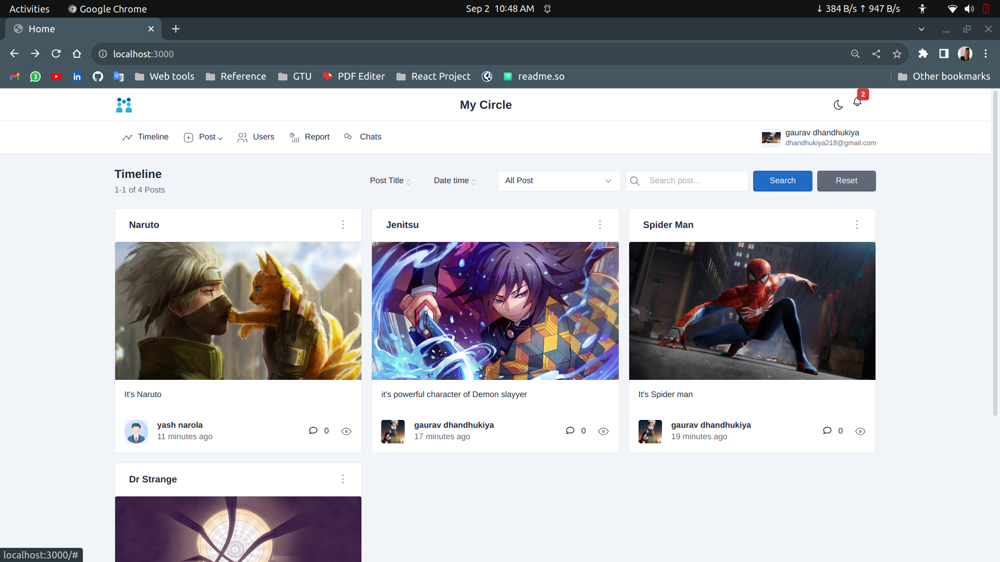
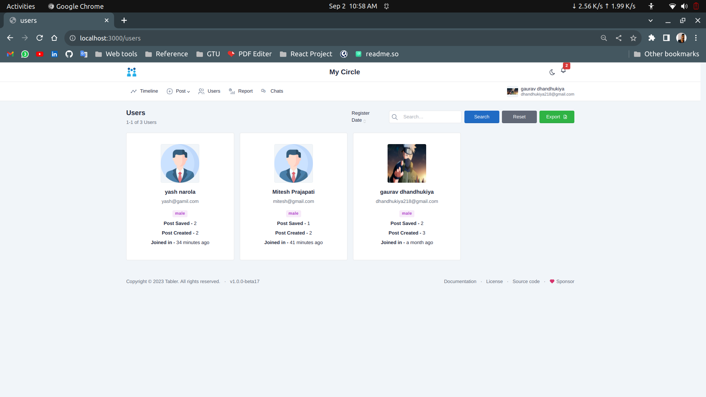
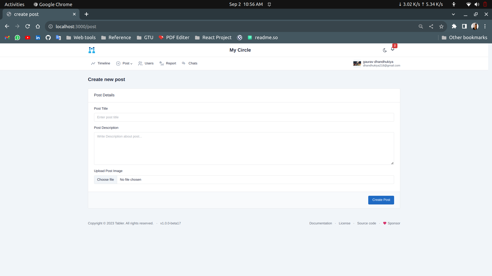
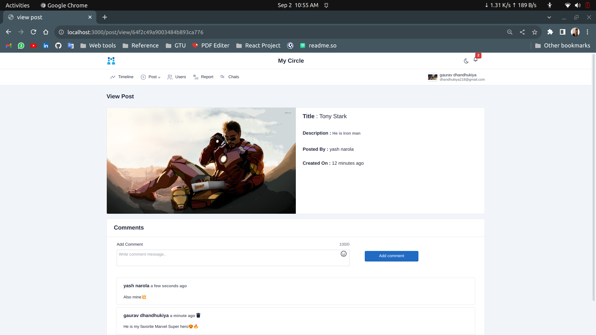
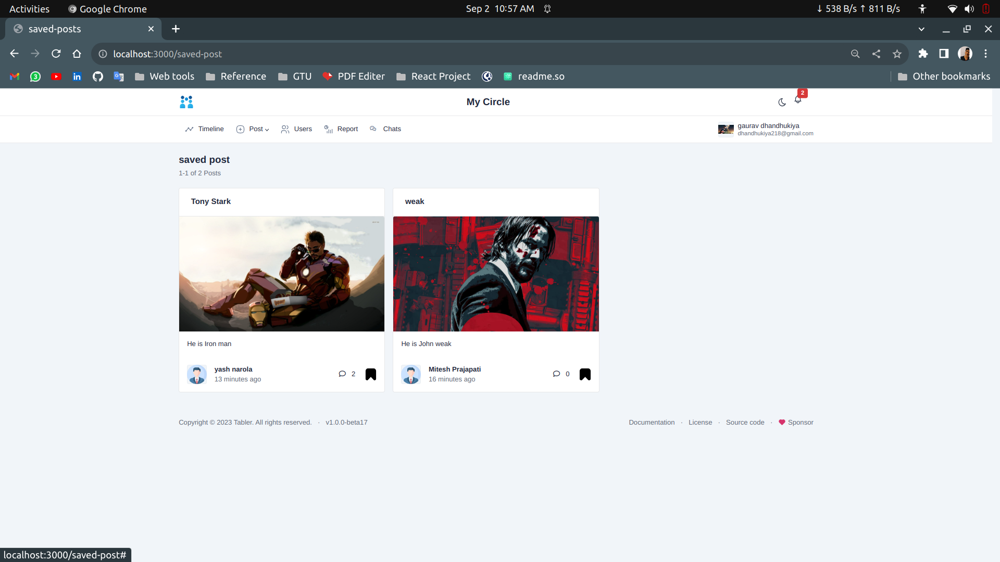
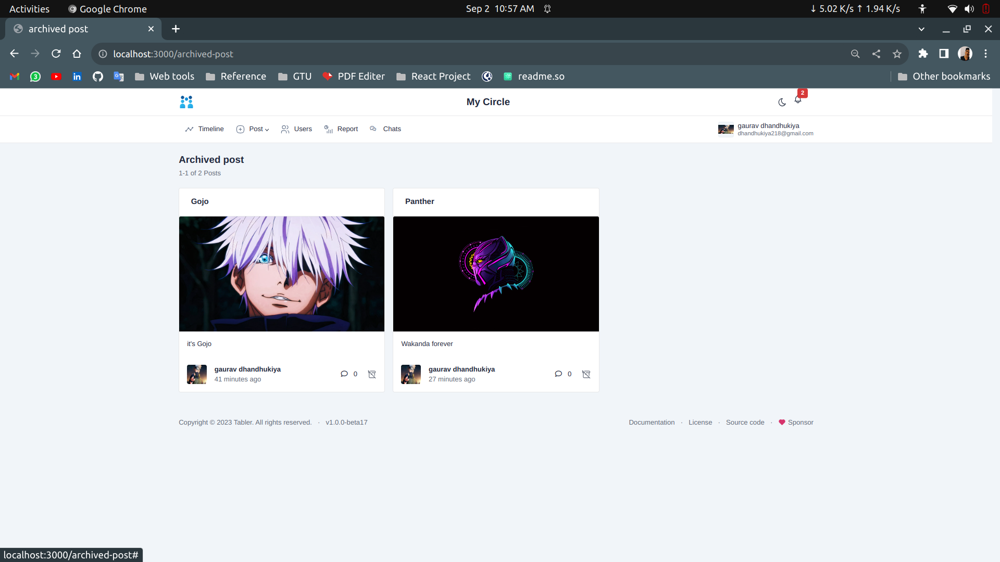
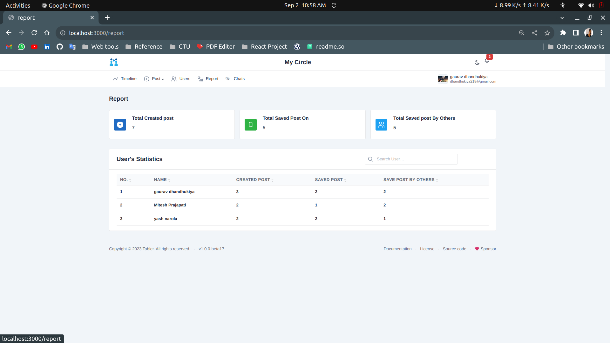
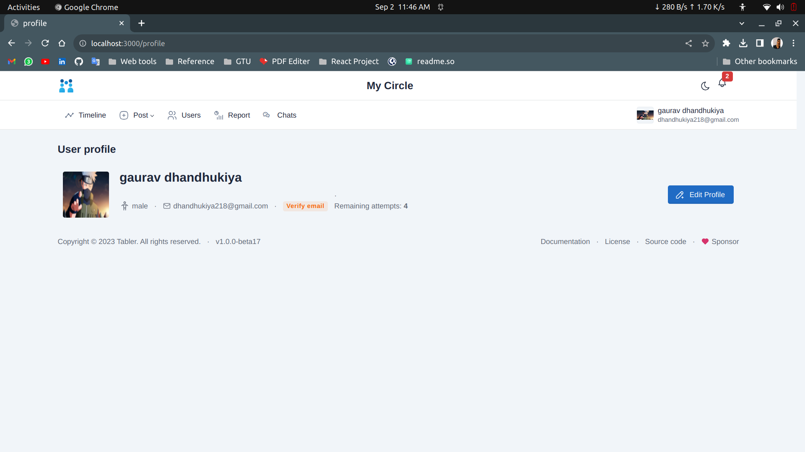

# Social Media App (NodeJS + MongoDB)

I builded My Circle a Social Media Application in Full Stack [NodeJS](https://nodejs.org/).
Write Logic & API Part of the Application in [ExpressJS](https://expressjs.com/)
And Store the whole Application's Data in [MongoDB](https://www.mongodb.com/). Create View Part (Front End) in Express [Handlbars](https://handlebarsjs.com/) view engine. 

## Tech Stack

**Client:** HandlebarJS, Bootstrap, Jquery, AJAX 

**Server:** Node, Express

**Database:** MongoDB

**Authentaction:** PassportJS, MD5 Encryption

**Verification:** Node Miler (Email verify)

**Others:** Socket IO, CronJob, JSON to CSV  

## Features 🚀
- User Authentication By [PasportJS 🔐](https://www.passportjs.org/)
- Email Validation using [Node Mailer 📩](https://nodemailer.com/about/)
- Real time User's statistics using [Cron Job⌛](https://www.npmjs.com/package/cron)
- Real time notification & Chating with users using [Socket IO⚡](https://socket.io/)

## Demo of Modules

### 1. Dashboard

### 2. Users

### 3. Realtime Chatting with users
[Video Link 🔗](https://drive.google.com/file/d/1d6uYaoI1x0V3RO_rQRB9n1Wu3TEqivlG/view?usp=drive_link)

### 4. Create, View, Save & Archive the Post
- Create the Post 

- View the Post & also write comment on saved & own post 

- Save the Post 

- Arcive the own Post 

### 5. Statistics Report of Users

### 6. Profile

## Thank You For Visiting 🙏
